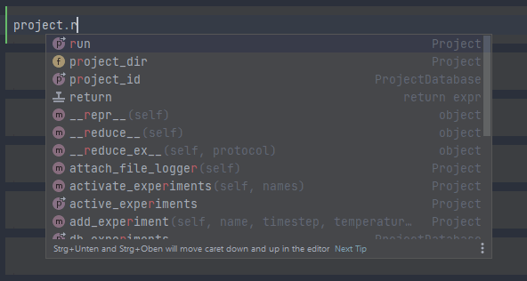

[](https://mdsuite.readthedocs.io/en/latest/)

[](https://coveralls.io/github/zincware/MDSuite?branch=main)
[](https://codeclimate.com/github/zincware/MDSuite/maintainability)
[](https://mybinder.org/v2/gh/zincware/MDSuite/HEAD)


Introduction
------------

MDSuite is a software designed specifically for the molecular dynamics community to
enable fast, reliable, and easy-to-run calculations from simulation data.

If you want to start learning about the code, you can check out the docs
[here](https://mdsuite.readthedocs.io/en/latest/).

Installation
============

There are several way to install MDSuite depending on what you would like from it.

One can simply installing using

````shell
pip install mdsuite
````

If you would like to install it from source then you can clone the repository by running

````shell
git clone https://github.com/SamTov/MDSuite.git
````


Once you have cloned the repository, depending on whether you prefer conda or straight
pip, you should follow the instructions below.

Installation with pip
*********************

````shell
  cd MDSuite
  pip install .
````

Installation with conda
***********************

````shell
   cd MDSuite
   conda create -n MDSuite python=3.8
   conda activate MDSuite
   pip install .
````


Documentation
=============

There is a live version of the documentation hosted
[here](https://mdsuite.readthedocs.io/en/latest/).
If you would prefer to have a local copy, it can be built using sphinx by following the
instructions below.

````shell
   cd MDSuite/docs
   make html
   cd build/html
   firefox index.html
````

HINT
====

Check out the MDSuite code through a jupyter notebook for a more user friendly
experience. You can take full advantage of the autocomplete features that are available
for the calculators.


